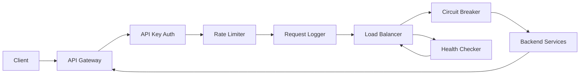

# API Gateway

## Problem (Simple)
When many different clients call multiple backend services directly, there’s no single place to control access, prevent abuse, record activity, or protect the system when one service starts failing. This leads to unfair traffic spikes, missing audit trails, and outages that spread across the system.

## Solution (Simple)
We provide a single, controlled entry point that sits between clients and backend services. It enforces access, limits traffic, records activity, and keeps the system stable when a backend misbehaves.

## What This Gateway Does
- API key authentication
- Rate limiting (token bucket or sliding window)
- Request logging (status, decision, reason)
- Circuit breaker to isolate failing backends
- Round‑robin load balancing with health checks
- Admin endpoints for live status
- UI dashboard + simulation controls

## What Is a Circuit Breaker (Simple)
A circuit breaker is a safety switch. If a backend keeps failing, the gateway stops sending requests to it for a short time so the system doesn’t waste time or overload a broken service. After a cooldown, it tries again.

## Basic Design
### Components
- Client: the caller sending requests
- API Gateway: the single front door
- API Key Auth: checks if the client is allowed
- Rate Limiter: controls how fast requests can be sent
- Request Logger: records what happened
- Circuit Breaker: pauses traffic to failing backends
- Load Balancer: spreads traffic across backends
- Health Checker: marks backends healthy or unhealthy
- Backend Services: the actual service instances

### How Components Interact
1. Client sends a request to the API Gateway.
2. API Key Auth validates the request.
3. Rate Limiter checks if the request rate is allowed.
4. Request Logger records the request details.
5. Load Balancer selects a healthy backend (using Health Checker info).
6. Circuit Breaker decides if the selected backend can receive traffic.
7. The request is forwarded to the Backend Service and the response returns to the Client.

## Component Interaction Diagram


## UI (React)
The UI is a simple React dashboard (loaded via CDN in a static HTML file). It shows:
- Overall metrics (total, accepted, rejected, auth failures, rate limit blocks, circuit blocks, backend errors)
- Backend health and circuit states
- Recent request table (decision + reason)
- Simulation controls
- Quick action: **Clear Blockers (Make Healthy)**

## Admin Endpoints
- `GET /admin/health` → backend health map
- `GET /admin/circuit` → circuit breaker states
- `GET /admin/metrics` → counters + overload flag
- `GET /admin/logs` → recent requests
- `GET /admin/reset` → clear blockers (force healthy + close circuits + reset metrics)
- `GET /admin/overload?state=on|off` → toggle overload mode

## Simulation Services (Separate)
There are two separate services for demos:
- **Backend Simulator** (mock backends on ports 9001/9002)
- **Load Simulator** (triggers scenarios on port 9100)

The Simulation UI (`/simulate`) calls the load simulator service.

### Scenario Behavior
- **Auth Happy**: 1 valid request (accepted)
- **Auth Worst**: floods invalid requests and toggles gateway overload so even happy requests get rejected until reset
- **Rate Happy/Worst**: normal vs high‑volume requests
- **Circuit Happy/Worst**: healthy vs failing backend causing circuit open
- **Health Happy/Worst**: toggles backend health
- **Load Happy/Worst**: shows normal distribution vs unhealthy backend

## Running Everything
### 1) Start the Gateway
```bash
mvn -q -f /Users/tanishsharma/Desktop/Project/APIGatewayProject/pom.xml compile exec:java@gateway
```

### 2) Start Backend Simulators (separate terminals)
```bash
mvn -q -f /Users/tanishsharma/Desktop/Project/APIGatewayProject/pom.xml exec:java@backend-sim -Dexec.args="--port=9001 --name=backend-1 --healthy=true"
```
```bash
mvn -q -f /Users/tanishsharma/Desktop/Project/APIGatewayProject/pom.xml exec:java@backend-sim -Dexec.args="--port=9002 --name=backend-2 --healthy=true"
```

### 3) Start Load Simulator (separate terminal)
```bash
mvn -q -f /Users/tanishsharma/Desktop/Project/APIGatewayProject/pom.xml exec:java@load-sim
```

### 4) Open the UI
- `http://localhost:8080/ui`
- `http://localhost:8080/simulate`

## Quick Test (Manual)
```bash
curl -H "X-API-Key: demo-key-1" http://localhost:8080/happy
```

## Notes
- If backends are actually down, health checks will eventually mark them unhealthy again after a reset.
- The load simulator must be running on port 9100 for the simulation UI to work.
